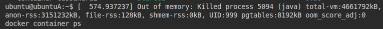
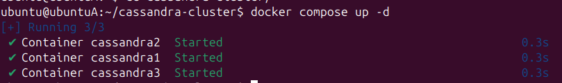
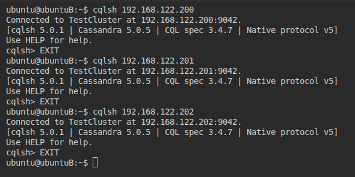
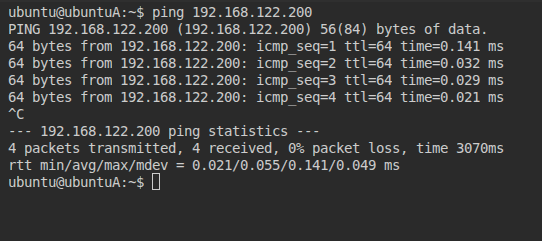
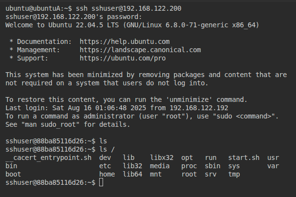
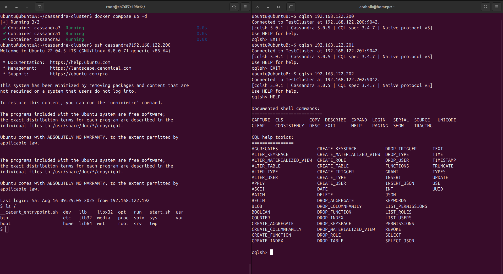

## Ходжаев Абдужалол

## Оглавление

- [Задание](#задание)
- [Кластер из 3 контейнеров Cassandra с фиксированными IP](#кластер-из-3-контейнеров-cassandra-с-фиксированными-ip)
  - [На машине А](#на-машине-а)
    - [Сетевое окружение](#сетевое-окружение)
    - [Пример описания сервиса Cassandra](#пример-описания-сервиса-cassandra)
    - [Ограничение ресурсов](#ограничение-ресурсов)
    - [Запуск](#запуск)
  - [Работа на машине Б](#работа-на-машине-б)
  - [Возвращаемся на машину А](#возвращаемся-на-машину-а)
    - [Решение проблемы сетевой доступности](#решение-проблемы-сетевой-доступности)
    - [Настройка SSH](#настройка-ssh)
      - [Dockerfile:](#dockerfile)
      - [Скрипт запуска `start.sh`:](#скрипт-запуска-startsh)
      - [Изменения в docker-compose:](#изменения-в-docker-compose)
- [Результат](#результат)
- [Комментарии](#комментарии)
- [Ссылки](#ссылки)

# Задание

- На машине А (Ubuntu 24.04 LTS) в локальной сети с IP 192.168.1.197 необходимо запустить docker-compose скрипт для поднятия трёх контейнеров Cassandra с IP-адресами 192.168.1.200–202.
- С машины Б (Ubuntu 24.04 LTS) из той же сети с IP 192.168.1.198 требуется подключиться к каждому из контейнеров через `cqlsh`.
- Настроить SSH-доступ с 1.197 на 1.200.

>[!Note]
> Для тестирования использовалась среда с виртуальными машинами. Подробнее — в [директории](/testenv/)
>

>[!NOTE]
> Причина использования сети 192.168.122.0/24 на скриншотах объяснена [здесь](./testenv/)

# Кластер из 3 контейнеров Cassandra с фиксированными IP

## На машине А

Все сервисы описаны в одном `docker-compose.yml`. Для каждого контейнера необходимо открыть порты, задать переменные окружения и корректно настроить сеть.

### Сетевое окружение

Для доступа к контейнерам из локальной сети стандартная NAT-сеть Docker не подходит. Используем драйвер `macvlan`, который позволяет контейнерам получать собственные MAC-адреса и выглядеть как отдельные устройства в сети.

Пример настройки сети:
```yaml
networks:
    cassandra_net:
        driver: macvlan
        driver_opts:
            parent: enp1s0 # Укажите физический интерфейс, через который контейнеры будут доступны
        ipam:
            config:
                - subnet: 192.168.1.0/24
                    gateway: 192.168.1.1
```

`subnet` определяет диапазон адресов для контейнеров. Если известно, что используются только адреса 192.168.1.197–202, можно сузить подсеть, например до `192.168.1.192/28` и зарезервировать эти адреса на роутере.

### Пример описания сервиса Cassandra

```yaml
...
cassandraN:
    image: cassandra:latest
    container_name: cassandraN
    ports:
        - "K:9042" # K = 9042 + N - 1 или другой свободный порт
    networks:
        cassandra_net:
            ipv4_address: 192.168.1.201
    environment:
        - CASSANDRA_CLUSTER_NAME=TestCluster
        - CASSANDRA_BROADCAST_ADDRESS=192.168.1.201
        - CASSANDRA_SEEDS=192.168.1.200,192.168.1.201,192.168.1.202
        - CASSANDRA_ENDPOINT_SNITCH=GossipingPropertyFileSnitch
...
```

### Ограничение ресурсов

На слабых машинах (например ВМ как у меня) возможна ошибка Out of Memory:



Тогда нужно ограничить ресурсы JVM и (опционально) контейнера:

```yaml
...
    environment:
        - MAX_HEAP_SIZE=2G
        - HEAP_NEWSIZE=512M
...
    deploy:
        resources:
            limits:
                memory: 2g
...
```

### Запуск



## Работа на машине Б

Нужно установить `cqlsh` через snap:

```bash
sudo snap install cqlsh
```

Проверить соединение:



## Возвращаемся на машину А

Попытка подключения по ssh к контейнеру завершится ошибкой `Connection refused`, так как ssh-сервер на контейнере не установлен и не запущен. Кроме того, при использовании `macvlan` контейнеры недоступны с хоста напрямую из-за особенностей маршрутизации.

### Решение проблемы сетевой доступности

Создадим дополнительный интерфейс для связи между хостом и сетью macvlan:

```bash
ip link add virtnet-shim link enp1s0 type macvlan mode bridge
ip addr add 192.168.1.192/32 dev virtnet-shim
ip link set virtnet-shim up
ip route add 192.168.1.200/32 dev virtnet-shim
```
`/32` — маршрут только к одному адресу.

Теперь контейнер с адресом .200 доступен с хоста:



### Настройка SSH

Для установки SSH-сервера потребуется изменить образ Cassandra.

#### Dockerfile:

```Dockerfile
FROM cassandra:latest

RUN apt-get update && \
        apt-get install -y --no-install-recommends openssh-server && \
        rm -rf /var/lib/apt/lists/*

RUN useradd -m -u 1337 cassandra || true && \
        mkdir -p /home/cassandra/.ssh && \
        chown cassandra:cassandra /home/cassandra/.ssh && \
        chmod 700 /home/cassandra/.ssh

COPY id_rsa.pub /tmp/id_rsa.pub
RUN cat /tmp/id_rsa.pub >> /home/cassandra/.ssh/authorized_keys && \
        chown cassandra:cassandra /home/cassandra/.ssh/authorized_keys && \
        chmod 600 /home/cassandra/.ssh/authorized_keys && \
        rm /tmp/id_rsa.pub

RUN echo "PubkeyAuthentication yes" >> /etc/ssh/sshd_config && \
        sed -i \
                -e 's/#PermitRootLogin prohibit-password/PermitRootLogin no/' \
                -e 's/#PasswordAuthentication yes/PasswordAuthentication no/' \
                /etc/ssh/sshd_config

COPY start.sh /start.sh
RUN chmod +x /start.sh

CMD ["/start.sh"]
```

- Устанавливается `openssh-server`
- Создаётся пользователь cassandra с домашней директорией
- Публичный ключ копируется в `authorized_keys`
- Включается аутентификация по ключу, отключается root и парольный доступ

#### Скрипт запуска `start.sh`:

```bash
service ssh start
exec docker-entrypoint.sh "$@"
```

#### Изменения в docker-compose:

```yaml
...
    cassandra1:
        build: .
        container_name: cassandra1
        ports:
            - "9042:9042"
        networks:
            cassandra_net:
                ipv4_address: 192.168.1.200
        environment:
            - CASSANDRA_CLUSTER_NAME=TestCluster
            - CASSANDRA_BROADCAST_ADDRESS=192.168.1.200
            - CASSANDRA_SEEDS=192.168.1.200,192.168.1.201,192.168.1.202
            - CASSANDRA_ENDPOINT_SNITCH=GossipingPropertyFileSnitch
            - MAX_HEAP_SIZE=2G
            - HEAP_NEWSIZE=512M
        deploy:
            resources:
                limits:
                    memory: 3g
...
```

`build: .` указывает на контекст сборки образа из текущей директории. После изменений в `Dockerfile` или `start.sh` нужно отключать кэш: 
```bash
docker compose build --no-cache
```

Запустим контейнеры и проверим SSH-доступ:



# Результат



# Комментарии

>[!NOTE]
> Не забыть учесть корректность физическего интерфейса в секции `networks`

>[!NOTE]
> Для ssh-доступа скопировать публичный ключ с машины А в директорию с `Dockerfile`

>[!Warning]
> Без настройки SSH контейнеры не будут принимать подключения. Для тестирования без SSH используйте [этот скрипт](./cassandra-cluster-nossh/docker-compose.yml)

# Ссылки

- [Официальный образ Cassandra](https://hub.docker.com/_/cassandra)
- [Гайд по macvlan](https://blog.oddbit.com/post/2018-03-12-using-docker-macvlan-networks/)
- [Документация sshd](https://www.opennet.ru/man.shtml?topic=sshd&category=8&russian=0)
- [Запуск контейнера из Dockerfile](https://forums.docker.com/t/start-container-service-in-a-shell-or-not/126051/3)
- [Cassandra seed nodes](https://www.ibm.com/docs/en/npi/1.3.1?topic=cluster-setting-up-cassandra-seed-nodes)
- [Решение OutOfMemory](https://support.datastax.com/s/article/java-lang-OutOfMemoryError-Java-heap-space)