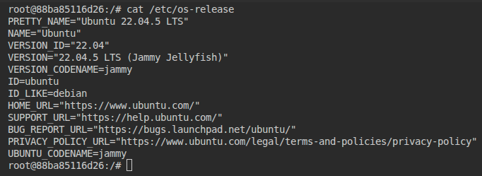

## Ходжаев Абдужалол 
# Задание
- На машине А (ubuntu 24.04 lts) в локальной сети с ip 192.168.1.197 запускается скрипт docker-compose для поднятия 3 образов с ip адресами 192.168.1.200-202.
- Затем с машины Б (ubuntu 24.04 lts) из той же локальной сети с ip 192.168.1.198 необходимо подключиться через cqlsh к каждой из машин-образов.
- Настроить ssh для возможности подключения к 1.200 с 1.197

>[!Note]
> Для тестирования скрипта использовалось окружение с виртуальными машинами. Подробности в соответствующей [директории](/testenv/)

# 3 образа кассандры с указанными ip адресами

## На машине А

Все три сервиса описаны в одном файле. В текущем случае N-го сервиса нужно открыть порты, настроить через переменные окружения, а также описать взаимодействия с сетью.

Начну с сети. Чтобы образы были доступны в локальной сети, NAT-сеть докера не подходит. Можно воспользоваться `macvlan` - сетью . Основная идея `macvlan` в создании виртуальных интерфейсов, которые рассматрываются системой как отдельное устройство. Каждый интерфейс получает свой MAC-адрес. 

Настроим сеть:
```YAML
networks:
  cassandra_net: 
    driver: macvlan # Тип драйвера сети нужнр указать macvlan
    driver_opts:
      parent: enp1s0 # Нужно будет указать физический интерфейс который станет шлюзом/посредником для сети контейнеров
    ipam:
      config:
        - subnet: 192.168.1.0/24 
          gateway: 192.168.1.1 # Шлюз для этой сети

```

`- subnet: 192.168.1.0/24` - Нужно указать подсеть в котором будут работать контейнеры. Зная что машины и образы находятся в пределе `192.168.1.197-202`, можно было бы сузить подсеть например до `192.168.1.192/28` (16 адресов) и зарезервировать эти адреса в роутере, чтобы контейнеры не занимали чужие IP

Для N-й `cassandra` следующее описание:
```YAML
...
cassandraN:
    image: cassandra:latest
    container_name: cassandraN
    ports:
      - "K:9042" # K = 9042 + N - 1 или любой другой свободный порт
    networks:
      cassandra_net:
        ipv4_address: 192.168.1.201 # Адрес в сети
    environment:
      - CASSANDRA_CLUSTER_NAME=TestCluster # Имя кластера
      - CASSANDRA_BROADCAST_ADDRESS=192.168.1.201 # Адрес бродкаста
      - CASSANDRA_SEEDS=192.168.1.200,192.168.1.201,192.168.1.202 # Другие ноды кластера
      - CASSANDRA_ENDPOINT_SNITCH=GossipingPropertyFileSnitch
...
``` 

Но если как в моём случае памяти немного (ВМ), можно столкнутся со следующей проблемой:


Поэтому нужно ограничить образ:
```YAML
...
    environment:
      - MAX_HEAP_SIZE=2G
      - HEAP_NEWSIZE=512M
...
    deploy:
      resources:
        limits:
          memory: 2g
...
```

В первую очередь нужно ограничить jvm
```
MAX_HEAP_SIZE=2G
HEAP_NEWSIZE=512M
```

Этого скорее всего будет достаточно, но можно также ограничить контейнер:
```
    deploy:
      resources:
        limits:
          memory: 2g
```


Запускаем:


## Переключяемся на машину Б
В `ubuntu-24.04-lts` можно установить `cqlsh` через snap store. Установим одноимённый пакет

```bash
sudo snap install cqlsh
```

Проверим соединение


Как видим соединение есть

## Переключаемся на машину А

Если мы просто попробуем подключиться по ssh к первому образу, мы получим ошибку `Connection refused`, так как сервер ssh в образе не установлен и не запущен. 

Но даже если мы просто попробуем попинговать образы из машины А, ответов не будет, так как при использовании `macvlan` создаётся виртуальный интерфейс, и для сети это будет выглядет как отдельная сетевая карта. При этом, macvlan не роутит пакеты между физическим и вирутальным интерфейсом. 

Сначала нам нужно решить проблему соединения, потом настроить ssh.

**Соединение**
Создадим новый интерфейс который будет бриджом между хостом и macvlan сетью
```bash
ip link add virtnet-shim link enp1s0 type macvlan mode bridge
```

Назначим ему свободный адрес из 192.168.1.0/24
```bash
ip addr add 192.168.1.192/32 dev virtnet-shim
```

Поднимем этот интерфейс:
```bash
ip link set virtnet-shim up
```

Назначим его шлюзем для 192.168.1.200
```bash
ip route add 192.168.1.200/32 dev virtnet-shim
```
`/32` значит только этот адрес

Теперь образ .200 пингуется


**Настройка ssh**

Опционально с помощью `docker exec -it cassandra1 bash`, можно выполнить
`cat /etc/os-release` и выяснить на каком ОС основан образ (Если не увидели название ОС при входе в `bash` контейнера)



Но это можно было бы сделать если бы команда `apt` не была распознана

Отключаем контейнеры
```bash
docker compose down
```

Добавляем `Dockerfile`:
```Dockerfile
FROM cassandra:latest

RUN apt update && \
    apt install -y openssh-server sudo && \
    mkdir -p /var/run/sshd && \
    useradd -ms /bin/bash sshuser && \
    echo 'sshuser:password' | chpasswd && \ 
    usermod -aG sudo sshuser 

COPY start.sh /start.sh
RUN chmod +x /start.sh  

CMD [ "/start.sh" ]
```

Свой образ cassandra с ssh создаём на основе официального образа cassandra. 

Нужно установить следующие пакеты:
- `openssh-server` для сервера ssg
- `sudo` (опционально) для работы с рут правами через ssh

Можно было бы сделать возможным подключится через ssh как рут, но это небезопасно.

Добавляем нового пользователья и запускаем скрипт со следующим содержанием:
```bash
#!/bin/bash

/usr/sbin/sshd &

exec /usr/local/bin/docker-entrypoint.sh cassandra -f
```
`/usr/sbin/sshd &` - запуск ssh
`exec /usr/local/bin/docker-entrypoint.sh cassandra -f` - запуск cassandra

С новыми файлами нужно изменить скрипт docker-compose:
```YAML
...
  cassandra1:
    build: .
    container_name: cassandra1
    ports:
      - "9042:9042"
    networks:
      cassandra_net:
        ipv4_address: 192.168.1.200
    environment:
      - CASSANDRA_CLUSTER_NAME=TestCluster
      - CASSANDRA_BROADCAST_ADDRESS=192.168.1.200
      - CASSANDRA_SEEDS=192.168.1.200,192.168.1.201,192.168.1.202
      - CASSANDRA_ENDPOINT_SNITCH=GossipingPropertyFileSnitch
      - MAX_HEAP_SIZE=2G
      - HEAP_NEWSIZE=512M
    deploy:
      resources:
        limits:
          memory: 3g
...
```

Добавлен `build: .`, чтобы образ для первой cassandra собрался из Dockerfile на той же директории. При изменениях в `Dockerfile` или `start,sh` можно выполнять `docker compose build` с параметром `--no-cache`. Это нужно, чтобы не использовался кешированный образ, собранный из старого `Dockerfile` или с использованием старого `start.sh`

Запускаем скрипт и проверяем:


# Результат


# Комментарии
>[!NOTE]
>Причина по которой во всех скриншотах сеть 192.168.122.0/24 объяснена [здесь](./testenv/)

>[!NOTE]
>При использовании скрипта из этого репозитория нужно изменить родительский интерфейс на нужный интерфейс хоста в networks

# Ссылки

- Образ cassandra https://hub.docker.com/_/cassandra 
- Полезный гайд по macvlan https://blog.oddbit.com/post/2018-03-12-using-docker-macvlan-networks/
- 